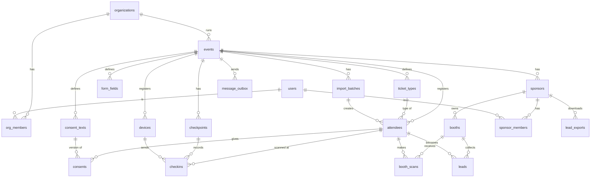

# Event Management Platform — Tech Stack & Data Model

อ้างอิง feature จาก [FEATURES.md](./FEATURES.md) — เอกสารนี้ครอบคลุม Phase 1 (MVP) เป็นหลัก
และเผื่อโครงสร้างไว้สำหรับ Phase 2–3

---

## 1. Tech Stack

### ภาพรวม

```
┌──────────────────────────── Next.js app (TypeScript) ─────────────────────────────┐
│  /register/*     หน้าลงทะเบียน attendee (SSR, หลายภาษา)                              │
│  /t/*            e-ticket + หน้า "บัตรของฉัน" (attendee)                              │
│  /b/:boothCode   หน้า sponsor เมื่อ attendee สแกน QR บูธ                             │
│  /scan           PWA สแกน (staff เช็คอิน + staff บูธ) — ทำงาน offline               │
│  /org/*          Organizer console + dashboard                                     │
│  /sponsor/*      Sponsor portal (ดู/export lead)                                   │
│  /api/*          REST API (route handlers) + /api/sync สำหรับเครื่องสแกน             │
└───────────────┬───────────────────────────────────────────────┬───────────────────┘
                │                                               │
        PostgreSQL (ข้อมูลหลัก)                       Worker (BullMQ บน Redis)
                │                                     ส่ง email/LINE, สร้าง Wallet pass,
           Redis (cache counter                       import Excel, สร้าง report/export
           dashboard, pub/sub realtime)                         │
                                                        Object storage (S3-compatible)
                                                        โลโก้, ผังงาน, ไฟล์ import/export
```

### รายการเลือกใช้

| ส่วน | เลือก | เหตุผล |
|---|---|---|
| ภาษา | **TypeScript** ทั้ง frontend/backend | ทีมเดียวทำได้ทั้งระบบ, share type ระหว่าง client กับ server |
| Web framework | **Next.js (App Router)** | หน้า public ต้อง SSR (เร็ว, SEO), console/portal ใช้ React เดียวกัน, API อยู่ในที่เดียว |
| UI | **Tailwind CSS + shadcn/ui** | ทำ console/form ได้เร็ว |
| i18n | **next-intl** | route แยกภาษา `/th`, `/en`, เพิ่มภาษาได้ด้วยไฟล์ข้อความ |
| Database | **PostgreSQL 16** | ข้อมูลเชิง relation ชัด, `jsonb` สำหรับฟอร์ม custom, unique constraint ช่วยกันข้อมูลซ้ำ |
| ORM / migration | **Drizzle ORM** | type-safe, SQL ตรงไปตรงมา, ทำ view/materialized view ได้ง่าย |
| Validation | **Zod** | ใช้ schema เดียวกันทั้ง form, API, และ sync payload |
| Auth (staff/organizer/sponsor) | **Better Auth** (email + password / magic link) | self-host, รองรับ organization + role |
| Auth (attendee) | magic link + ticket token | attendee ไม่ต้องตั้งรหัสผ่าน |
| เครื่องสแกน | **PWA** + **Dexie (IndexedDB)** + Service Worker (Workbox) | ใช้มือถือ/แท็บเล็ตอะไรก็ได้ ไม่ต้องลงแอป, เก็บรายชื่อและคิวการสแกนในเครื่อง |
| อ่าน QR | **zxing-wasm** (กล้อง) + รองรับเครื่องยิงบาร์โค้ด USB/Bluetooth (keyboard input) | เร็วและแม่นกว่า lib JS ล้วน |
| QR token | signed token (**Ed25519**, ไลบรารี `@noble/ed25519`) | เครื่องสแกนตรวจลายเซ็นได้เองแม้ offline (ถือ public key) |
| Background jobs | **BullMQ + Redis** | ส่ง email/LINE จำนวนมาก, retry อัตโนมัติ |
| Realtime dashboard | Redis counter + **Server-Sent Events** | เบากว่า WebSocket, พอสำหรับตัวเลขที่อัปเดตทางเดียว |
| Email | **Amazon SES** (หรือ Resend) | ส่งหลักหมื่นฉบับได้ถูก |
| LINE | LINE Messaging API (Phase 1: ส่งบัตร, Phase 2: OA เต็มรูปแบบ) | คนไทยเปิด LINE มากกว่า email |
| Wallet | `passkit-generator` (Apple), Google Wallet API | Add to Wallet |
| Excel import/export | **ExcelJS** | อ่าน/เขียน .xlsx ได้ทั้งสองทาง |
| พิมพ์ badge | สร้าง PDF ด้วย **@react-pdf/renderer** หรือ HTML print → เครื่องพิมพ์ label | ไม่ผูกกับยี่ห้อเครื่องพิมพ์ |
| Storage | S3-compatible (AWS S3 / Cloudflare R2) | |
| Hosting | **AWS ap-southeast-7 (Bangkok)** หรือ ap-southeast-1: ECS Fargate + RDS Postgres + ElastiCache | เก็บข้อมูลส่วนบุคคลในภูมิภาค, scale ตามช่วง peak ได้ |
| Monitoring | Sentry + OpenTelemetry | |
| Load test | **k6** | |
| Repo | **pnpm workspace** (monorepo) | |

### โครง repo

```
ev/
├─ apps/
│  ├─ web/              Next.js (หน้า public, console, portal, API, PWA สแกน)
│  └─ worker/           BullMQ worker (email, LINE, wallet, import, export, report)
├─ packages/
│  ├─ db/               Drizzle schema, migrations, views, seed
│  ├─ core/             business logic (registration, checkin, lead, consent) — ไม่ผูก framework
│  ├─ qr/               สร้าง/ตรวจ signed token (ใช้ทั้ง server และเครื่องสแกน)
│  └─ i18n/             ข้อความทุกภาษา
└─ docs/
```

---

## 2. Data Model

### หลักการ

- **Primary key เป็น UUIDv7** ทุกตาราง — เรียงตามเวลาได้ และเครื่องสแกนสร้าง id เองได้ตอน offline
- **Multi-tenant ด้วย `event_id`**: เกือบทุกตารางมี `event_id` เพื่อกรองข้อมูลและทำ index
- **ข้อความหลายภาษา** เก็บเป็น `jsonb` รูปแบบ `{"th": "...", "en": "..."}` (ชนิดในเอกสารนี้เรียกว่า `i18n`)
- **ข้อมูลอ่อนไหว** (เลขบัตร ปชช./passport) เข้ารหัสระดับ column และเก็บ hash แยกไว้สำหรับค้นหา
- **Soft delete** เฉพาะตารางหลัก (`deleted_at`) — การลบข้อมูลส่วนบุคคลตามกำหนดใช้การ anonymize แทนการลบแถว เพื่อให้สถิติยังถูกต้อง
- ทุกตารางมี `created_at`, `updated_at` (ไม่ได้เขียนซ้ำในตารางด้านล่าง)

### ER Diagram (Phase 1)



### 2.1 บัญชีและสิทธิ์

**`users`** — ทุกคนที่ล็อกอินเข้าระบบหลังบ้าน (organizer, staff, sponsor, admin) ส่วน attendee ไม่อยู่ในตารางนี้

| column | type | หมายเหตุ |
|---|---|---|
| id | uuid | |
| email | citext | unique |
| name | text | |
| password_hash | text | null ได้ถ้าใช้ magic link |
| locale | text | ภาษาที่ใช้ใน console |
| is_platform_admin | bool | admin ฝั่งเรา |

**`organizations`** — บริษัทผู้จัดงาน (ลูกค้าหลัก และเป็นหน่วยที่ใช้ผูกกับสินเชื่อใน Phase 3)

| column | type | หมายเหตุ |
|---|---|---|
| id | uuid | |
| name | text | |
| tax_id | text | null ได้ |
| contact_email, contact_phone | text | |

**`org_members`** — `(org_id, user_id)` unique, `role`: `owner` \| `manager` \| `staff`
- `staff` ใช้ได้เฉพาะหน้าสแกนเช็คอินของงานใน org นั้น

### 2.2 Event setup

**`events`**

| column | type | หมายเหตุ |
|---|---|---|
| id | uuid | |
| org_id | uuid → organizations | |
| slug | text | unique — ใช้ใน URL ลงทะเบียน |
| name | i18n | |
| description | i18n | |
| starts_at, ends_at | timestamptz | |
| timezone | text | default `Asia/Bangkok` |
| venue_name, venue_address | text | |
| floor_plan_url | text | รูปผังงาน |
| locales | text[] | ภาษาที่เปิดใช้ เช่น `{th,en,zh}` |
| default_locale | text | |
| status | enum | `draft` \| `open` \| `closed` \| `live` \| `ended` |
| registration_opens_at, registration_closes_at | timestamptz | |
| capacity | int | null = ไม่จำกัด |
| qr_key_id | text | ระบุคู่กุญแจที่ใช้เซ็น QR ของงานนี้ |
| settings | jsonb | ค่าปลีกย่อย เช่น อนุญาต walk-in, ช่องทางส่งบัตร |

**`ticket_types`**

| column | type | หมายเหตุ |
|---|---|---|
| id | uuid | |
| event_id | uuid | |
| code | text | unique ต่อ event เช่น `VIP` |
| name | i18n | |
| kind | enum | `general` \| `vip` \| `staff` \| `press` \| `speaker` |
| quota | int | null = ไม่จำกัด |
| issued_count | int | นับไว้ล่วงหน้าเพื่อเช็ค quota เร็ว (อัปเดตใน transaction เดียวกับการลงทะเบียน) |
| is_public | bool | false = ออกให้ได้เฉพาะ import/organizer (เช่น staff, press) |
| price_satang | int | Phase 2 (ขายบัตร) — Phase 1 เป็น 0 |
| badge_color | text | สีบน badge |
| sort_order | int | |

**`form_fields`** — ฟิลด์ฟอร์มลงทะเบียนที่ organizer ปรับได้

| column | type | หมายเหตุ |
|---|---|---|
| id | uuid | |
| event_id | uuid | |
| key | text | unique ต่อ event เช่น `company`, `interests` |
| type | enum | `text` \| `email` \| `phone` \| `select` \| `multiselect` \| `country` \| `checkbox` \| `date` |
| label | i18n | |
| options | jsonb | สำหรับ select: `[{"value":"fintech","label":{"th":"..","en":".."}}]` |
| required | bool | |
| is_system | bool | ฟิลด์ที่ระบบใช้และลบไม่ได้ (ชื่อ, email, สัญชาติ, เอกสารยืนยันตัวตน) |
| shared_with_sponsor | bool | ฟิลด์นี้ส่งให้ sponsor ใน lead หรือไม่ |
| ticket_type_ids | uuid[] | null = แสดงทุกประเภทบัตร |
| sort_order | int | |

> ฟิลด์ระบบ (ชื่อ, email, เบอร์, สัญชาติ, บริษัท, ตำแหน่ง) เป็น column จริงใน `attendees` เพื่อให้ค้นหาและทำ report ได้เร็ว
> ฟิลด์ที่ organizer เพิ่มเองเก็บใน `attendees.answers` (jsonb)

### 2.3 Attendee และ consent

**`attendees`** — 1 แถว = 1 คน ต่อ 1 งาน = 1 บัตร

| column | type | หมายเหตุ |
|---|---|---|
| id | uuid | |
| event_id | uuid | |
| ticket_type_id | uuid | |
| ticket_code | text | รหัสสั้นอ่านได้ เช่น `EV-7K2Q-9MXD` — unique ต่อ event, ใช้ค้นหน้างานกรณีสแกนไม่ได้ |
| qr_version | int | เพิ่มเมื่อออกบัตรใหม่ → QR เก่าใช้ไม่ได้ |
| first_name, last_name | text | |
| email | citext | unique `(event_id, email)` เมื่อไม่ null |
| phone | text | รูปแบบ E.164, ไม่บังคับ (ต่างชาติไม่มีเบอร์ไทย) |
| nationality | char(2) | ISO 3166-1 |
| id_doc_type | enum | `thai_id` \| `passport` \| `other` \| null |
| id_doc_number_enc | bytea | เข้ารหัส |
| id_doc_number_hash | text | HMAC สำหรับค้นหา/กันลงทะเบียนซ้ำ |
| company, job_title | text | |
| locale | text | ภาษาที่ใช้ส่งบัตร/ข้อความ |
| answers | jsonb | คำตอบฟิลด์ custom `{ "interests": ["fintech"], ... }` |
| source | enum | `online` \| `import` \| `walk_in` \| `organizer` |
| import_batch_id | uuid | null ได้ |
| status | enum | `registered` \| `cancelled` |
| first_checked_in_at | timestamptz | denormalize จาก `checkins` เพื่อให้ dashboard/รายชื่อเร็ว |
| line_user_id | text | ถ้าผูก LINE |
| anonymized_at | timestamptz | ลบข้อมูลส่วนบุคคลแล้ว |

Index: `(event_id, status)`, `(event_id, ticket_code)` unique, `(event_id, lower(last_name), lower(first_name))`, `(event_id, id_doc_number_hash)`

**`consent_texts`** — ข้อความขอความยินยอมแต่ละเวอร์ชัน (ต้องรู้ว่าคนกดยอมรับข้อความไหน)

| column | type | หมายเหตุ |
|---|---|---|
| id | uuid | |
| event_id | uuid | |
| purpose | enum | `terms` \| `share_with_scanned_sponsors` \| `organizer_marketing` \| `photo` |
| version | int | unique `(event_id, purpose, version)` |
| body | i18n | |
| required | bool | `terms` = true, `share_with_scanned_sponsors` = false |
| published_at | timestamptz | |

**`consents`** — เก็บทุกการให้/ถอนความยินยอม (append-only ไม่แก้ทับ)

| column | type | หมายเหตุ |
|---|---|---|
| id | uuid | |
| attendee_id | uuid | |
| consent_text_id | uuid | ระบุ purpose + version |
| granted | bool | true = ยินยอม, false = ถอน |
| channel | enum | `web_form` \| `walk_in` \| `import` \| `self_service` |
| ip, user_agent | text | |
| recorded_at | timestamptz | |

View **`attendee_current_consents`**: แถวล่าสุดของแต่ละ `(attendee_id, purpose)` — ใช้เป็นแหล่งเดียวในการตัดสินว่าแชร์ข้อมูลได้หรือไม่

**`import_batches`**

| column | type | หมายเหตุ |
|---|---|---|
| id | uuid | |
| event_id | uuid | |
| uploaded_by | uuid → users | |
| file_key | text | ไฟล์ใน storage |
| column_mapping | jsonb | คอลัมน์ Excel → ฟิลด์ |
| default_ticket_type_id | uuid | |
| status | enum | `pending` \| `validating` \| `importing` \| `done` \| `failed` |
| total_rows, created_rows, skipped_rows | int | |
| errors | jsonb | `[{row: 12, message: "email ซ้ำ"}]` |
| send_tickets | bool | ส่งบัตรทันทีหลัง import หรือไม่ |

### 2.4 Check-in หน้างาน

**`checkpoints`** — จุดเช็คอิน เช่น ประตู A, ประตู B, ห้อง VIP

| column | type | หมายเหตุ |
|---|---|---|
| id | uuid | |
| event_id | uuid | |
| name | text | |
| kind | enum | `entrance` \| `session` (Phase 2) \| `vip_area` |
| allowed_ticket_type_ids | uuid[] | null = ทุกประเภท |

**`devices`** — เครื่องสแกนที่ลงทะเบียนไว้ (ต้องรู้ว่าข้อมูลมาจากเครื่องไหน)

| column | type | หมายเหตุ |
|---|---|---|
| id | uuid | สร้างตอนเครื่อง pair ครั้งแรก |
| event_id | uuid | |
| name | text | เช่น "Gate A - iPad 3" |
| mode | enum | `checkin` \| `booth` |
| booth_id | uuid | ถ้า mode = booth |
| paired_by | uuid → users | |
| last_seen_at, last_synced_at | timestamptz | |
| snapshot_version | bigint | เวอร์ชันรายชื่อ attendee ล่าสุดที่เครื่องโหลดไปแล้ว |
| revoked_at | timestamptz | |

**`checkins`** — ทุกการสแกน (รวมสแกนซ้ำ/ไม่ผ่าน) เพื่อใช้ทำ log และสถิติ

| column | type | หมายเหตุ |
|---|---|---|
| id | uuid | **เครื่องสแกนสร้างเอง** → ส่งซ้ำกี่ครั้งก็บันทึกครั้งเดียว (`ON CONFLICT (id) DO NOTHING`) |
| event_id | uuid | |
| attendee_id | uuid | null ถ้า QR อ่านไม่ออก/ไม่พบ |
| checkpoint_id | uuid | |
| device_id | uuid | |
| staff_user_id | uuid | |
| direction | enum | `in` \| `out` |
| result | enum | `accepted` \| `already_in` \| `wrong_ticket_type` \| `cancelled` \| `unknown` |
| raw_code | text | ข้อมูลที่สแกนได้ (กรณี unknown) |
| scanned_at | timestamptz | เวลาบนเครื่อง |
| received_at | timestamptz | เวลาที่ server ได้รับ |

เมื่อบันทึก `accepted` ครั้งแรก → set `attendees.first_checked_in_at` (ถ้ายังเป็น null) + เพิ่ม counter ใน Redis

**`badge_prints`** — `(id, attendee_id, device_id, printed_by, printed_at, reason: first|reprint)` ใช้ตรวจการพิมพ์ badge ซ้ำ

### 2.5 Sponsor และ lead capture

**`sponsors`**

| column | type | หมายเหตุ |
|---|---|---|
| id | uuid | |
| event_id | uuid | |
| name | text | |
| tier | enum | `platinum` \| `gold` \| `silver` \| `exhibitor` |
| logo_url | text | |
| description | i18n | แสดงในหน้าที่ attendee เห็นหลังสแกนบูธ |
| website_url | text | |
| contact_email | text | ที่ส่ง post-event report |
| lead_package | enum | `basic` \| `pro` — ใช้กำหนดฟีเจอร์/ราคาในอนาคต |
| cta_buttons | jsonb | ปุ่มที่ attendee เห็น เช่น `[{"action":"interested","label":{...}},{"action":"request_info",...}]` |

**`booths`**

| column | type | หมายเหตุ |
|---|---|---|
| id | uuid | |
| event_id | uuid | |
| sponsor_id | uuid | 1 sponsor มีได้หลายบูธ |
| code | text | unique ต่อ event เช่น `B12` |
| qr_slug | text | unique ทั้งระบบ, สุ่มยาว → QR = `https://<domain>/b/<qr_slug>` |
| location | jsonb | ตำแหน่งบนผัง `{x, y, zone}` |

**`sponsor_members`** — `(sponsor_id, user_id)` unique, `role`: `admin` (ดู/export lead) \| `booth_staff` (สแกน + ใส่โน้ต)

**`booth_scans`** — ทุกครั้งที่มีการ "เจอกัน" ระหว่าง attendee กับบูธ (append-only, ใช้นับ traffic)

| column | type | หมายเหตุ |
|---|---|---|
| id | uuid | สร้างฝั่ง client ได้ (กรณีสแกนจากเครื่องบูธแบบ offline) |
| event_id | uuid | |
| booth_id | uuid | |
| attendee_id | uuid | |
| source | enum | `attendee_scanned_booth` \| `staff_scanned_badge` |
| action | enum | `visit` \| `interested` \| `request_info` |
| device_id | uuid | null ถ้า attendee สแกนด้วยมือถือตัวเอง |
| staff_user_id | uuid | null ได้ |
| scanned_at | timestamptz | |

**`leads`** — 1 แถวต่อ `(booth_id, attendee_id)` สรุปจาก `booth_scans` + ข้อมูลที่ staff บูธใส่เพิ่ม

| column | type | หมายเหตุ |
|---|---|---|
| id | uuid | |
| event_id | uuid | |
| sponsor_id | uuid | |
| booth_id | uuid | unique `(booth_id, attendee_id)` |
| attendee_id | uuid | |
| first_scanned_at, last_scanned_at | timestamptz | |
| scan_count | int | |
| interest_level | enum | สูงสุดที่ attendee เลือก: `visit` < `interested` < `request_info` |
| rating | enum | `hot` \| `warm` \| `cold` \| null — staff บูธให้คะแนน |
| notes | text | โน้ตจาก staff บูธ |
| tags | text[] | |
| rated_by | uuid → users | |

View **`sponsor_visible_leads`** — สิ่งที่ sponsor portal และ export อ่านได้**เท่านั้น**:
`leads` JOIN `attendees` JOIN `attendee_current_consents` WHERE purpose = `share_with_scanned_sponsors` AND granted = true AND `attendees.anonymized_at IS NULL`
และเลือกเฉพาะ column ใน `attendees` / `answers` ที่ `form_fields.shared_with_sponsor = true`
(lead ที่ไม่ได้ consent ยังนับใน traffic ของบูธได้ แต่ sponsor เห็นแค่ตัวเลข ไม่เห็นตัวบุคคล)

**`lead_exports`** — log ทุกการ export (หลักฐานการแชร์ข้อมูลตาม PDPA)

| column | type | หมายเหตุ |
|---|---|---|
| id | uuid | |
| sponsor_id | uuid | |
| exported_by | uuid → users | |
| format | enum | `csv` \| `xlsx` |
| filters | jsonb | |
| attendee_ids | uuid[] | รายชื่อที่อยู่ในไฟล์ |
| file_key | text | ไฟล์หมดอายุตามกำหนด |
| created_at | timestamptz | |

### 2.6 การส่งข้อความ / log / report

**`message_outbox`** — ทุกข้อความที่ส่งออก (email, LINE) ผ่าน worker

| column | type | หมายเหตุ |
|---|---|---|
| id | uuid | |
| event_id | uuid | |
| attendee_id | uuid | null ได้ (เช่นส่งหา sponsor) |
| channel | enum | `email` \| `line` |
| template | text | เช่น `ticket`, `reminder`, `sponsor_report` |
| locale | text | |
| payload | jsonb | |
| status | enum | `queued` \| `sent` \| `failed` \| `bounced` |
| attempts | int | |
| provider_message_id | text | |
| sent_at | timestamptz | |

**`audit_logs`** — การกระทำสำคัญในหลังบ้าน (แก้ข้อมูล attendee, เปลี่ยนสิทธิ์, ดูข้อมูลอ่อนไหว, export)

| column | type | หมายเหตุ |
|---|---|---|
| id | uuid | |
| actor_user_id | uuid | |
| event_id | uuid | null ได้ |
| action | text | เช่น `attendee.update`, `lead.export` |
| entity_type, entity_id | text, uuid | |
| diff | jsonb | |
| ip | text | |
| created_at | timestamptz | |

**Report / dashboard** — ไม่สร้างตารางแยก ใช้ materialized view refresh ทุก 1 นาทีระหว่างงาน:
- `mv_event_stats` — ลงทะเบียน vs เข้างาน แยกตามประเภทบัตร / สัญชาติ / ช่วงเวลา (ราย 15 นาที)
- `mv_booth_stats` — จำนวนสแกนต่อบูธ, unique visitor, จำนวน lead ที่ consent, สัดส่วน hot/warm/cold

ตัวเลข real-time บนหน้าจอ (คนเข้างานตอนนี้) อ่านจาก Redis counter แล้วส่งผ่าน SSE

---

## 3. รูปแบบ QR

| QR | เนื้อหา | ใครสแกน |
|---|---|---|
| **e-ticket / badge** ของ attendee | `EV1.<event_short>.<attendee_id_base32>.<qr_version>.<signature>` — เซ็นด้วย Ed25519 private key ของงาน | staff เช็คอิน, staff บูธ |
| **บูธ** | URL `https://<domain>/b/<qr_slug>` | attendee ใช้กล้องมือถือสแกน → เปิดเว็บ |

- เครื่องสแกนเก็บ public key ของงาน → ตรวจว่า QR ของจริงได้ทันทีโดยไม่ต้องต่อเน็ต แล้วค้นชื่อ/ประเภทบัตรจากรายชื่อใน IndexedDB
- QR บูธเป็น URL ธรรมดา เพื่อให้แอปกล้องมือถือทุกเครื่องเปิดได้ ถ้าเบราว์เซอร์นั้นยังไม่รู้ว่าเป็นใคร จะให้ยืนยันตัวด้วย ticket code หรือ magic link หนึ่งครั้ง แล้วจำ session ไว้ (ลิงก์ในอีเมลบัตรจะ login ให้อัตโนมัติ)

---

## 4. API หลักของเครื่องสแกน

| Endpoint | หน้าที่ |
|---|---|
| `POST /api/devices/pair` | ผูกเครื่องกับงาน/บูธ → ได้ `device_id` + token |
| `GET /api/sync/snapshot?since=<version>` | โหลดรายชื่อ attendee (เฉพาะ field ที่จำเป็น: id, ชื่อ, บริษัท, ประเภทบัตร, สถานะ, qr_version) แบบ delta |
| `POST /api/sync/checkins` | ส่งคิวการสแกนเป็น batch (สูงสุด 500 รายการ) → ตอบกลับ id ที่บันทึกแล้ว |
| `POST /api/sync/booth-scans` | เหมือนกัน สำหรับเครื่องบูธ (รวม rating/notes) |
| `POST /api/walk-in` | ลงทะเบียนหน้างาน (ถ้า offline จะเข้าคิวรอส่ง, ใช้ id ที่เครื่องสร้าง) |

---

## 5. เผื่อไว้สำหรับ Phase 2–3 (ยังไม่สร้างใน MVP)

| Phase | ตารางที่จะเพิ่ม |
|---|---|
| 2 — Gamification | `quests` (เงื่อนไข เช่น สแกนครบ N บูธ), `quest_completions`, `prize_draws` — นับจาก `booth_scans` ได้เลย |
| 2 — Session / agenda | `sessions`, `session_registrations`; เช็คอินรายห้องใช้ `checkpoints.kind = session` ที่มีอยู่แล้ว |
| 2 — ขายบัตร | `orders`, `order_items`, `payments` (PromptPay / gateway), `refunds` |
| 2 — Survey / NPS | `surveys`, `survey_responses` |
| 2 — AI lead | เพิ่ม column `ai_summary`, `ai_segment` ใน `leads` |
| 3 — Budget | `budgets`, `budget_lines`, `expenses`, `suppliers`, `sponsor_contracts`, `revenues` |
| 3 — สินเชื่อ | `loan_applications`, `loans`, `repayments`, `credit_profiles` (คำนวณจากประวัติ event ของ `organizations`) |

ทุกตารางข้างบนผูกกับ `organizations` / `events` ที่มีอยู่แล้ว จึงไม่ต้องแก้โครงสร้าง MVP
